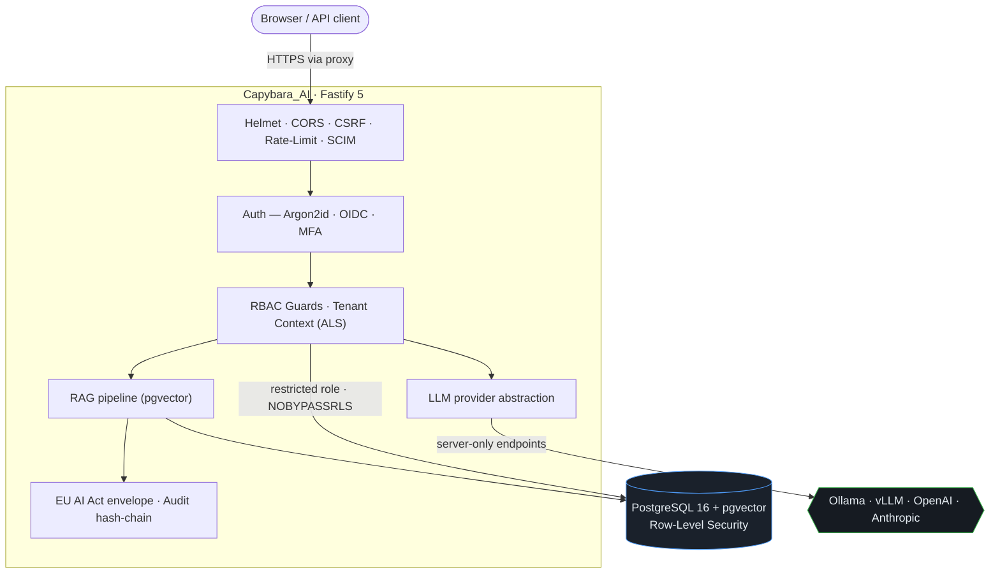

<div align="center">

# 🐹 Capybara_AI

**Self-hosted, GDPR-compliant generative-AI workspace for SMBs.**

Security first. Multi-tenant. Auditable. Secure-by-default from the very first
commit — so companies can run their own AI without ever handing data to a third
party.

[](https://github.com/BEKO2210/Capybara_AI/actions/workflows/ci.yml)
[](https://github.com/BEKO2210/Capybara_AI/actions/workflows/security.yml)
[](.github/workflows/ci.yml)
[](CHANGELOG.md)
[](LICENSE)


[🇩🇪 Deutsch](README.md) · **🇬🇧 English**

</div>

---

## What is Capybara_AI?

Capybara_AI is a **self-hosted AI platform** for organizations that must not — or
will not — put their data into someone else's cloud. Chat with local or cloud
LLMs, document intelligence (RAG) over your own knowledge base, an admin backend,
SSO/SCIM integration — all with demonstrable GDPR compliance and EU AI Act
transparency.

Built for auditability: every security decision is an **architectural decision
from day one**, not a bolt-on. Dangerous defaults *fail closed* — production
refuses to start with weak secrets.

## Highlights

| Area | What's inside |
| --- | --- |
| 🔐 **Zero-trust tenancy** | PostgreSQL Row-Level Security under a restricted role (NOBYPASSRLS). Cross-tenant access is impossible at the DB layer — even with a forgotten `WHERE`. |
| 🛡️ **Fail-closed config** | Production refuses to start on missing/weak secrets, wildcard CORS, insecure cookies, or a non-TLS database URL. |
| 👤 **Auth & SSO** | Argon2id, opaque server sessions (only the SHA-256 hash stored), TOTP MFA, OIDC SSO, **SCIM 2.0** provisioning. |
| 🧩 **RBAC** | `owner / admin / member / viewer` with least-privilege guards (401/403, deny-by-default). |
| 📚 **Document intelligence (RAG)** | pgvector search, ingestion pipeline, classification-based ACL, optional ClamAV scan, lifecycle & legal hold. |
| 🤖 **LLM provider abstraction** | Local-first (Ollama/vLLM, OpenAI-compatible) + cloud (OpenAI, Anthropic). Endpoints are **server-only** — closing the `base_url` SSRF class. |
| 📜 **EU AI Act & GDPR** | Transparency envelope on every AI response, AI inventory, human oversight, atomic GDPR erasure, data export. |
| 🔏 **Field-level encryption** | AES-256-GCM at rest, envelope encryption (KEK→DEK) with **key rotation** that re-encrypts chunks & messages under a new key. |
| 🧾 **Tamper-evident audit** | Hash-chained `security_events` (append-only), **off-box Ed25519 anchoring**, offline verifiable (`npm run verify:chain`). |
| 🚦 **Layered rate limiting** | Per IP/account/LLM/upload, per-org storage quota, brute-force lockout with exponential backoff + admin unlock. |
| 🐳 **Hardened Docker** | Non-root, `cap_drop ALL`, `no-new-privileges`, read-only FS, Postgres not published, fail-closed on missing secrets. |
| ♻️ **Backup & DR** | `backup.sh` / `restore.sh`, retention, optional GPG encryption, disaster-recovery runbook, deep `/healthz`. |

## Why Capybara_AI?

| | Data sovereignty | GDPR | EU AI Act | On-premise | Price | Compliance docs |
| --- | :---: | :---: | :---: | :---: | :---: | :---: |
| **Capybara_AI** | ✅ full | ✅ built-in | ✅ Art. 4/14/50 | ✅ yes | 💚 Open Source | ✅ included |
| ChatGPT Enterprise | ❌ US cloud | ⚠️ via DPA | ⚠️ partial | ❌ no | 💰 $/seat | ❌ separate |
| Azure OpenAI | ⚠️ MS cloud (EU region) | ✅ via DPA | ⚠️ partial | ❌ no | 💰 usage | ⚠️ partial |
| self-hosted Ollama | ✅ full | ⚠️ DIY | ❌ none | ✅ yes | 💚 free | ❌ none |

Capybara_AI combines the **data sovereignty** of a self-hosted Ollama with the
**compliance depth** and **auditability** enterprises otherwise only get from
commercial suites — without vendor lock-in and without data leaving your premises.

## Screenshots

> Preview placeholders (scale-accurate SVGs, 1280×800) — to be replaced with real
> screenshots once available.

| Dashboard | Documents + RAG chat |
| --- | --- |
|  |  |
| **Compliance report** | **User management** |
|  |  |

## Architecture (overview)



## Quickstart (Docker)

```bash
git clone https://github.com/BEKO2210/Capybara_AI.git
cd Capybara_AI/docker
cp ../.env.example .env          # fill in STRONG values!
docker compose -f docker-compose.yml up --build
# App listens on 127.0.0.1:3000 (loopback). Health: GET /healthz
```

Required in `.env`: `POSTGRES_PASSWORD`, `DB_APP_PASSWORD`, `COOKIE_SECRET`,
`SESSION_SECRET` — production also needs `ENCRYPTION_KEY`,
`DOCUMENT_ENCRYPTION_KEY`, `MASTER_KEK`, `CORS_ALLOWED_ORIGINS`, `APP_BASE_URL`.

```bash
node -e "console.log(require('crypto').randomBytes(32).toString('base64'))"  # COOKIE/SESSION
node -e "console.log(require('crypto').randomBytes(32).toString('hex'))"     # ENCRYPTION_KEY / MASTER_KEK
```

## Local development

```bash
npm install
npm run typecheck      # strict TypeScript, ESM
npm test               # Vitest + Testcontainers (real Postgres + RLS)
npm run db:migrate     # migrations (privileged role)
npm run verify:chain   # verify the audit chain (+ anchors)
```

Tests use Testcontainers with pgvector. Most run against a real PostgreSQL
instance — tenant isolation is verified for real (including a direct RLS probe),
not mocked.

## System requirements

| | Minimum (self-host) |
| --- | --- |
| **Container** | Docker / Compose |
| **RAM** | 16 GB (more for larger local models) |
| **CPU** | 4 cores |
| **Disk** | 100 GB (documents + DB + models) |
| **DB** | PostgreSQL 16 with the `vector` extension |
| **LLM** | Ollama/vLLM locally *or* an OpenAI/Anthropic key |

## Security & compliance

- **Threat Model**, **Security Architecture**, **Incident Response** and
  **Deployment Security** documented in the repo.
- **OWASP ASVS 5.0** and **OWASP Top 10 for LLM/GenAI 2025** mapped to
  implementing modules + tests (`docs/security/`).
- **GDPR**: data map, retention, atomic erasure, export — see `PRIVACY_AND_GDPR.md`.
- **EU AI Act**: transparency on every AI response, AI inventory, human oversight.
- **Audit integrity**: off-box Ed25519 anchoring + KMS/secret-manager key source —
  see [`docs/security/AUDIT_ANCHORING_AND_KMS.md`](docs/security/AUDIT_ANCHORING_AND_KMS.md).
- **Supply chain**: `npm audit`, OSV scan, gitleaks, CycloneDX SBOM in CI.

Found a vulnerability? Please do **not** report it publicly — see [SECURITY.md](SECURITY.md).

## Supported by

<div align="center">

**EU AI Act ✓**  ·  **GDPR ✓**  ·  **BSI-Grundschutz ✓**  ·  **Apache-2.0 ✓**

</div>

## Documentation

- [`docs/DISASTER_RECOVERY.md`](docs/DISASTER_RECOVERY.md) — backup/restore runbook
- [`docs/security/AUDIT_ANCHORING_AND_KMS.md`](docs/security/AUDIT_ANCHORING_AND_KMS.md) — anchoring, key custody, scale-out
- [`docker/README.md`](docker/README.md) — containers & stacks
- [`ENTERPRISE_READINESS.md`](ENTERPRISE_READINESS.md) — maturity checklist
- [`docs/guides/`](docs/guides/) — SSO, SCIM, API quickstart, webhooks
- [`CONTRIBUTING.md`](CONTRIBUTING.md) · [`CHANGELOG.md`](CHANGELOG.md)

## License

[Apache-2.0](LICENSE) — including a patent grant, enterprise-friendly.
Third-party notices in [`NOTICE`](NOTICE) / [`ACKNOWLEDGMENTS.md`](ACKNOWLEDGMENTS.md).

---

<div align="center">

Built by **Belkis Aslani** (he/him) · GitHub: [@BEKO2210](https://github.com/BEKO2210) · Made in Germany 🇩🇪

</div>
