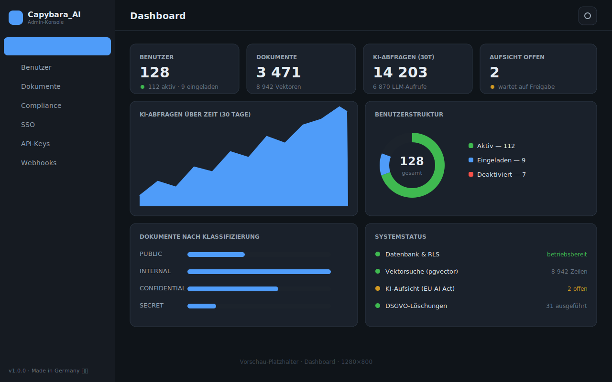
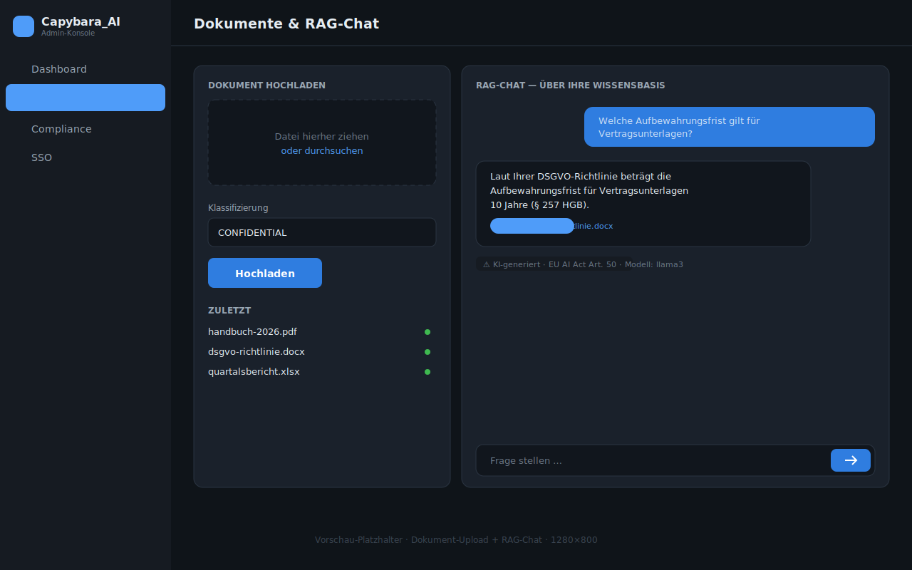
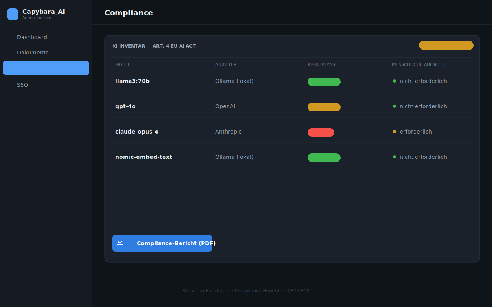
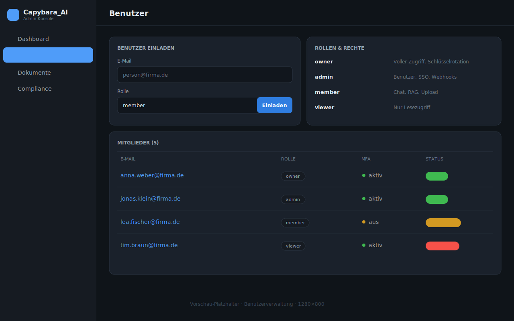
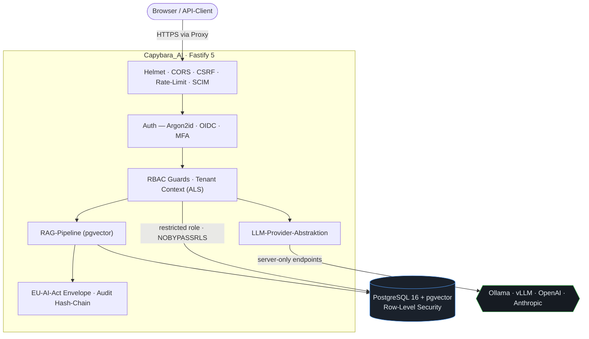

<div align="center">

# 🐹 Capybara_AI

**Self-hosted, DSGVO-konforme KI-Workspace für den Mittelstand.**

Sicherheit zuerst. Mandantenfähig. Auditierbar. Vom ersten Commit an
secure-by-default — damit Unternehmen ihre eigene KI betreiben, ohne Daten aus
der Hand zu geben.

[](https://github.com/BEKO2210/Capybara_AI/actions/workflows/ci.yml)
[](https://github.com/BEKO2210/Capybara_AI/actions/workflows/security.yml)
[](.github/workflows/ci.yml)
[](CHANGELOG.md)
[](LICENSE)


**🇩🇪 Deutsch** · [🇬🇧 English](README.en.md)

</div>

---

## Was ist Capybara_AI?

Capybara_AI ist eine **selbst gehostete KI-Plattform** für Unternehmen, die ihre
Daten nicht in fremde Clouds geben dürfen oder wollen. Chat mit lokalen oder
Cloud-LLMs, Dokumenten-Intelligenz (RAG) über die eigene Wissensbasis, ein
Admin-Backend, SSO/SCIM-Anbindung — und das alles mit nachweisbarer
DSGVO-Konformität und EU-AI-Act-Transparenz.

Gebaut für Auditierbarkeit: Jede Sicherheitsentscheidung ist eine
**Architekturentscheidung von Tag 1**, kein nachträglicher Aufsatz. Gefährliche
Defaults scheitern *fail-closed* — die Produktion startet gar nicht erst mit
schwachen Secrets.

## Highlights

| Bereich | Was drin ist |
| --- | --- |
| 🔐 **Zero-Trust-Mandanten** | PostgreSQL Row-Level-Security unter einer restriktiven Rolle (NOBYPASSRLS). Cross-Tenant-Zugriff ist auf DB-Ebene unmöglich — auch bei vergessenem `WHERE`. |
| 🛡️ **Fail-closed Konfiguration** | Produktion verweigert den Start bei fehlenden/schwachen Secrets, Wildcard-CORS, unsicheren Cookies oder DB-URL ohne TLS. |
| 👤 **Auth & SSO** | Argon2id, opaque Server-Sessions (nur SHA-256-Hash gespeichert), TOTP-MFA, **OIDC- & SAML-2.0-SSO**, **SCIM 2.0** User-Provisioning. |
| 🧩 **RBAC** | `owner / admin / member / viewer` mit Least-Privilege-Guards (401/403, deny-by-default). |
| 📚 **Dokumenten-Intelligenz (RAG)** | pgvector-Suche, Ingestion-Pipeline, klassifizierungsbasierte ACL, optionaler ClamAV-Scan, Lifecycle & Legal Hold. |
| 🤖 **LLM-Provider-Abstraktion** | Lokal zuerst (Ollama/vLLM, OpenAI-kompatibel) + Cloud (OpenAI, Anthropic). Endpunkte sind **server-only** — schließt die `base_url`-SSRF-Klasse. |
| 📜 **EU AI Act & DSGVO** | Transparenz-Envelope auf jeder KI-Antwort, KI-Inventar, menschliche Aufsicht (Human Oversight), atomare GDPR-Löschung, Datenexport. |
| 🔏 **Field-Level Encryption** | AES-256-GCM at rest, Envelope-Verschlüsselung (KEK→DEK) mit **Key-Rotation**, die Chunks & Nachrichten unter neuem Schlüssel re-verschlüsselt. |
| 🧾 **Tamper-Evident Audit** | Hash-verkettete `security_events` (append-only), **Off-Box-Anchoring (Ed25519)**, offline verifizierbar (`npm run verify:chain`). |
| 🚦 **Layered Rate Limiting** | Pro IP/Konto/LLM/Upload, Speicherquota pro Org, Brute-Force-Lockout mit exponentiellem Backoff + Admin-Unlock. |
| 🐳 **Gehärtetes Docker** | Non-root, `cap_drop ALL`, `no-new-privileges`, read-only FS, Postgres nicht veröffentlicht, fail-closed bei fehlenden Secrets. |
| ♻️ **Backup & DR** | `backup.sh` / `restore.sh`, Retention, optionale GPG-Verschlüsselung, Disaster-Recovery-Runbook, tiefer `/healthz`-Check. |

## Warum Capybara_AI?

| | Datensouveränität | DSGVO | EU AI Act | On-Premise | Preis | Compliance-Docs |
| --- | :---: | :---: | :---: | :---: | :---: | :---: |
| **Capybara_AI** | ✅ vollständig | ✅ eingebaut | ✅ Art. 4/14/50 | ✅ ja | 💚 Open Source | ✅ mitgeliefert |
| ChatGPT Enterprise | ❌ US-Cloud | ⚠️ via DPA | ⚠️ teilweise | ❌ nein | 💰 $/Seat | ❌ separat |
| Azure OpenAI | ⚠️ MS-Cloud (EU-Region) | ✅ via DPA | ⚠️ teilweise | ❌ nein | 💰 Verbrauch | ⚠️ teilweise |
| self-hosted Ollama | ✅ vollständig | ⚠️ Eigenleistung | ❌ nein | ✅ ja | 💚 kostenlos | ❌ keine |

Capybara_AI kombiniert die **Datenhoheit** eines selbst gehosteten Ollama mit der
**Compliance-Tiefe** und **Auditierbarkeit**, die Unternehmen sonst nur von
kommerziellen Suiten erwarten — ohne Vendor-Lock-in und ohne Datenabfluss.

## Screenshots

> Vorschau-Platzhalter (maßstabsgetreue SVGs, 1280×800) — werden durch echte
> Screenshots ersetzt, sobald verfügbar.

| Dashboard | Dokumente + RAG-Chat |
| --- | --- |
|  |  |
| **Compliance-Bericht** | **Benutzerverwaltung** |
|  |  |

## Architektur (Überblick)



## Quickstart (Docker)

```bash
git clone https://github.com/BEKO2210/Capybara_AI.git
cd Capybara_AI/docker
cp ../.env.example .env          # starke Werte eintragen!

# Pflicht: POSTGRES_PASSWORD, DB_APP_PASSWORD, COOKIE_SECRET, SESSION_SECRET
# Produktion zusätzlich: ENCRYPTION_KEY, DOCUMENT_ENCRYPTION_KEY, MASTER_KEK,
#                        CORS_ALLOWED_ORIGINS, APP_BASE_URL

docker compose -f docker-compose.yml up --build
# App lauscht auf 127.0.0.1:3000 (Loopback). Health: GET /healthz
```

Secrets generieren:

```bash
node -e "console.log(require('crypto').randomBytes(32).toString('base64'))"  # COOKIE/SESSION
node -e "console.log(require('crypto').randomBytes(32).toString('hex'))"     # ENCRYPTION_KEY / MASTER_KEK
```

## Lokale Entwicklung

```bash
npm install
npm run typecheck      # strict TypeScript, ESM
npm test               # Vitest + Testcontainers (echtes Postgres + RLS)
npm run db:migrate     # Migrationen (privilegierte Rolle)
npm run verify:chain   # Audit-Kette prüfen
```

Tests nutzen Testcontainers mit pgvector. Die meisten laufen gegen eine echte
PostgreSQL-Instanz — Tenant-Isolation wird real (inkl. direktem RLS-Probe)
verifiziert, nicht gemockt.

## Systemanforderungen

| | Minimum (Self-Host) |
| --- | --- |
| **Container** | Docker / Compose |
| **RAM** | 16 GB (mehr für größere lokale Modelle) |
| **CPU** | 4 Cores |
| **Disk** | 100 GB (Dokumente + DB + Modelle) |
| **DB** | PostgreSQL 16 mit `vector`-Extension |
| **LLM** | Ollama/vLLM lokal *oder* OpenAI/Anthropic-Schlüssel |

## Sicherheit & Compliance

- **Threat Model**, **Security Architecture**, **Incident Response** und
  **Deployment Security** im Repo dokumentiert.
- **OWASP ASVS 5.0** und **OWASP Top 10 für LLM/GenAI 2025** sind auf
  implementierende Module + Tests gemappt (`docs/security/`).
- **DSGVO/GDPR**: Datenkarte, Retention, atomare Löschung, Export — siehe
  `PRIVACY_AND_GDPR.md`.
- **EU AI Act**: Transparenz auf jeder KI-Antwort, KI-Inventar, Human Oversight.
- **Audit-Integrität**: Off-Box-Ed25519-Anchoring + KMS/Secret-Manager-Schlüsselquelle
  — siehe [`docs/security/AUDIT_ANCHORING_AND_KMS.md`](docs/security/AUDIT_ANCHORING_AND_KMS.md).
- **Supply Chain**: `npm audit`, OSV-Scan, gitleaks, CycloneDX-SBOM in CI.

Sicherheitslücke gefunden? Bitte **nicht** öffentlich melden — siehe
[SECURITY.md](SECURITY.md).

## Supported by

<div align="center">

**EU AI Act ✓**  ·  **DSGVO ✓**  ·  **BSI-Grundschutz ✓**  ·  **Apache-2.0 ✓**

</div>

Capybara_AI ist auf die Anforderungen der EU-KI-Verordnung (Art. 4/14/50) und der
DSGVO ausgelegt, orientiert sich an den Bausteinen des **BSI-Grundschutz** und
steht unter der permissiven **Apache-2.0**-Lizenz (inkl. Patent-Grant).

## Dokumentation

- [`docs/DISASTER_RECOVERY.md`](docs/DISASTER_RECOVERY.md) — Backup/Restore-Runbook
- [`docker/README.md`](docker/README.md) — Container & Stacks
- [`ENTERPRISE_READINESS.md`](ENTERPRISE_READINESS.md) — Reifegrad-Checkliste
- [`docs/guides/`](docs/guides/) — SSO, SCIM, API-Quickstart, Webhooks
- [`CONTRIBUTING.md`](CONTRIBUTING.md) · [`CHANGELOG.md`](CHANGELOG.md)

## Lizenz

[Apache-2.0](LICENSE) — inkl. Patent-Grant, unternehmensfreundlich.
Drittanbieter-Hinweise in [`NOTICE`](NOTICE) / [`ACKNOWLEDGMENTS.md`](ACKNOWLEDGMENTS.md).

---

<div align="center">

Built by **Belkis Aslani** (he/him) · GitHub: [@BEKO2210](https://github.com/BEKO2210) · Made in Germany 🇩🇪

</div>
